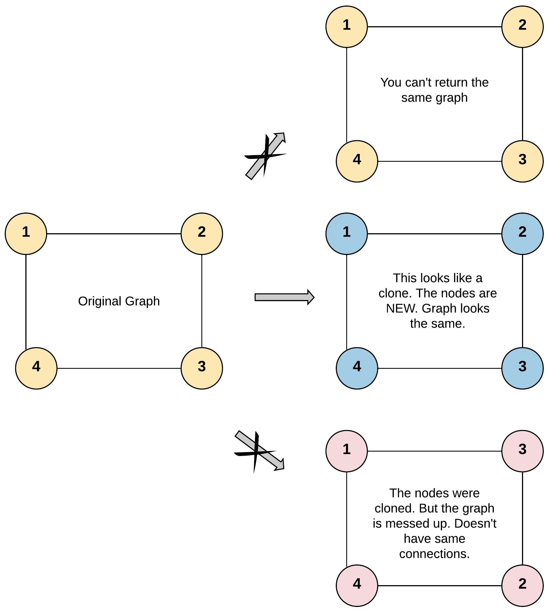

# [Clone Graph](https://leetcode.com/problems/clone-graph/description/)

Given a reference of a node in a connected undirected graph, return a deep copy (clone) of the graph. Each node in the graph contains:
- a value (`int`)
- a list (`List[Node]`) of its neighbors.

### Node Class Definition
```java
class Node {
    public int val;
    public List<Node> neighbors;
} 
```

## Test Case Format

- For simplicity, each node's value is the same as the node's index (1-indexed).
  - For example, the first node has `val == 1`, the second node has `val == 2`, and so on.
- The graph is represented in the test case using an adjacency list.
  - An adjacency list is a collection of unordered lists used to represent a finite graph.
  - Each list describes the set of neighbors of a node in the graph.
- The given node will always be the first node with `val = 1`.
- You must return the copy of the given node as a reference to the cloned graph.

---

### Example 1


**Input**: `adjList = [[2,4],[1,3],[2,4],[1,3]]`  
**Output**: `[[2,4],[1,3],[2,4],[1,3]]`  
**Explanation**: There are 4 nodes in the graph.
- The 1st node (val = 1) has neighbors 2nd node (val = 2) and 4th node (val = 4).
- The 2nd node (val = 2) has neighbors 1st node (val = 1) and 3rd node (val = 3).
- The 3rd node (val = 3) has neighbors 2nd node (val = 2) and 4th node (val = 4).
- The 4th node (val = 4) has neighbors 1st node (val = 1) and 3rd node (val = 3).

---

### Example 2

**Input**: `adjList = [[]]`  
**Output**: `[[]]`  
**Explanation**: The input contains one empty list, indicating the graph consists of only one node with `val = 1`, and it does not have any neighbors.

---

### Example 3

**Input**: `adjList = []`  
**Output**: `[]`  
**Explanation**: This is an empty graph, it does not have any nodes.

---

### Constraints

- The number of nodes in the graph is in the range `[0, 100]`.
- `1 <= Node.val <= 100`
- `Node.val` is unique for each node.
- There are no repeated edges and no self-loops in the graph.
- The graph is connected, and all nodes can be visited starting from the given node.

