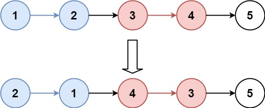

# [Reverse Nodes in k-Group](https://leetcode.com/problems/reverse-nodes-in-k-group/description/)

Given the head of a linked list, reverse the nodes of the list `k` at a time and return the modified list.

- `k` is a positive integer and is less than or equal to the length of the linked list.
- If the number of nodes is not a multiple of `k`, the remaining nodes at the end should remain as they are.
- Only the nodes themselves may be changed; the values within nodes should not be altered.

---

## Examples

### Example 1

- **Input:** `head = [1,2,3,4,5]`, `k = 2`
- **Output:** `[2,1,4,3,5]`

### Example 2

- **Input:** `head = [1,2,3,4,5]`, `k = 3`
- **Output:** `[3,2,1,4,5]`

---

## Constraints
- The number of nodes in the list is `n`.
- `1 <= k <= n <= 5000`
- `0 <= Node.val <= 1000`

---

## Follow-Up
Can you solve the problem in `O(1)` extra memory space?
